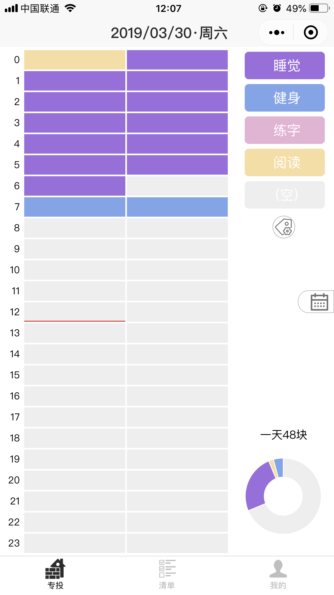
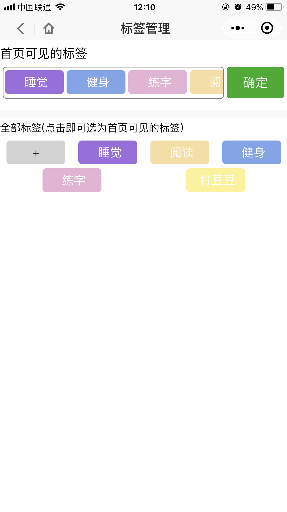
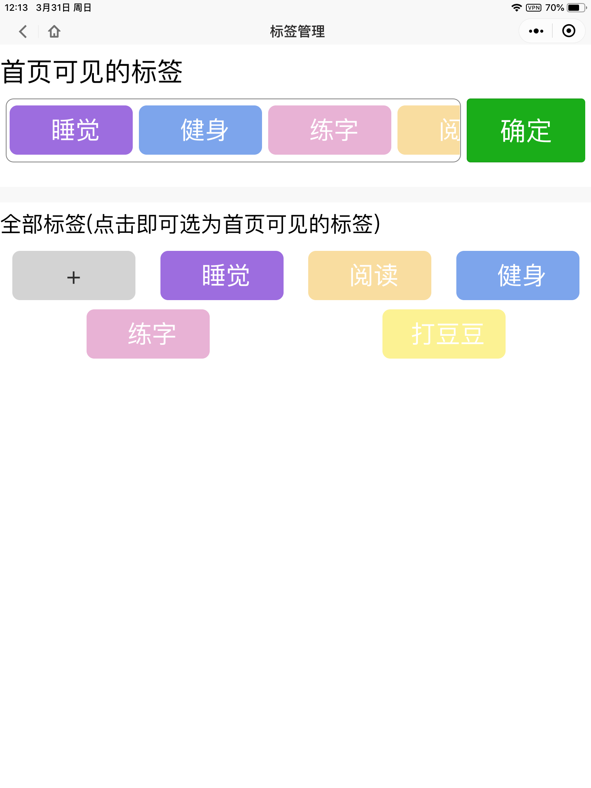

# 自定义组件-微信小程序顶部导航栏

## 特点
* `返回上一层`和`返回主页`的图标是[svg转base4](https://www.sojson.com/image2base64.html)格式,由`background-image`引用的图片,体积小不失真易改色
* 点击标题可触发`clickTitle`事件

## 使用
本仓库是一个使用该自定义导航的demo,整个下载并在**微信开发者工具**中打开运行即可查看.

引入自己项目的方式是把`components/navbar`目录复制到你的项目下,并按下面配置.

页面wxml
```wxml
<nav-bar navbar-data="{{navbarData}}" bind:clickTitle="onClickTitle"></nav-bar>
```

页面js
```js
//组件依赖的数据
data: {
  navbarData: {
    title: 'Index',     //标题
    showCapsule: true,  //是否显示左上角返回按钮
    homePage:'',        //tabbar主页url地址,不传或是传空字串那点主页按钮的效果就是返回上一层
  }
}
```

同时依赖全局变量
```js
app.globalData.navbarTop
app.globalData.isFromShare
```

app.js
```js
onLaunch(options) {
    let sysInfo = wx.getSystemInfoSync()
    //顶部导航栏top偏置，iphone8p: 20+4 ; mi5: 24+8
    this.globalData.navbarTop = (sysInfo.statusBarHeight + ((sysInfo.system.toLowerCase().indexOf('ios') > -1) ? 4 : 8))
    }
    // 判断是否由分享进入小程序
    this.globalData.isFromShare = ([1007, 1008].indexOf(options.scene) > -1) ? true : false
    
    
    //内容块的top偏置,顶头导航组件设置的高度是34px, 内容块与它间隙1px,所以top偏置35px
    this.globalData.contentTop = this.globalData.navbarTop + 35
    //内容块可视高度,内容块与下方小程序自带的tabbar距离3px,加上overflow:hidden后保证整个页面不会垂直滚动,这个值可以看需求微调
    this.globalData.contentHeight = sysInfo.windowHeight - this.globalData.contentTop - 3
```

app.json
```json
  "usingComponents": {
    "nav-bar": "/components/navbar/index"
  },
```

## 线上项目示例
### **砖头时间**--献给正在建筑梦想的你


#### 5.5寸iphone
首页

子页

#### 9.7寸ipad

#### 5寸安卓机


## 注意事项
* 导航栏的大小(如高度)不应随屏幕大小的改变而改变,因此应避免使用`rpx`单位
* 导航栏设置默认高度为34px,小程序右上角自带的胶囊一般高度是32px,正常情况自定导航栏向下超过胶囊2px

## 参考
[微信小程序 自定义头部导航栏 ](https://www.jianshu.com/p/7393c800ba09)